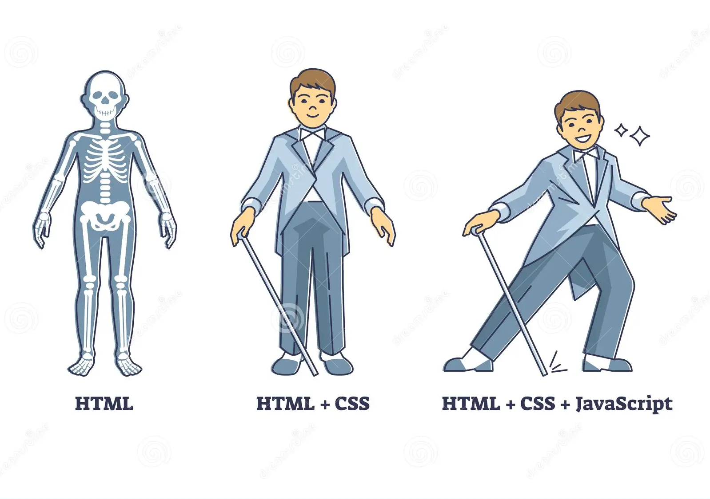

# HTML5 + CSS3

# HTML:

- 🔗[html-code-generator:](https://www.html-code-generator.com/)
- 🔗[html:](https://html.com/)
- 🔗[htmltowordpress:](https://htmltowordpress.io/)

# CSS:

- 🔗[Bootstrap:](https://getbootstrap.com/docs/5.0/getting-started/introduction/)
- 🔗[CSS Tricks:](https://css-tricks.com/)
- 🔗[Web Dev:](https://web.dev/learn/css/)
- 🔗[Flexboxfroggy:](https://flexboxfroggy.com/)
- 🔗[cssbattle:](https://cssbattle.dev/)
- 🔗[animate:](https://animate.style/)
- 🔗[minicss:](https://minicss.us/docs.htm)
- 🔗[Animation Maker:](https://dancelogo.com/)

---

- 🔗[Figma:](https://www.figma.com/)
- 🔗[MDN:](https://developer.mozilla.org/)

- 🔗[Code Pen:](https://codepen.io/)

- 🔗[Dev:](https://dev.to/)

- 🔗[hasnode:](https://hashnode.com/)

- 🔗[editorconfig:](https://editorconfig.org/)

- 🔗[chromewebstore:](https://chromewebstore.google.com/)

- 🔗[temp-mail:](https://temp-mail.org/en/)

- 🔗[RoadMap:](https://roadmap.sh/)

